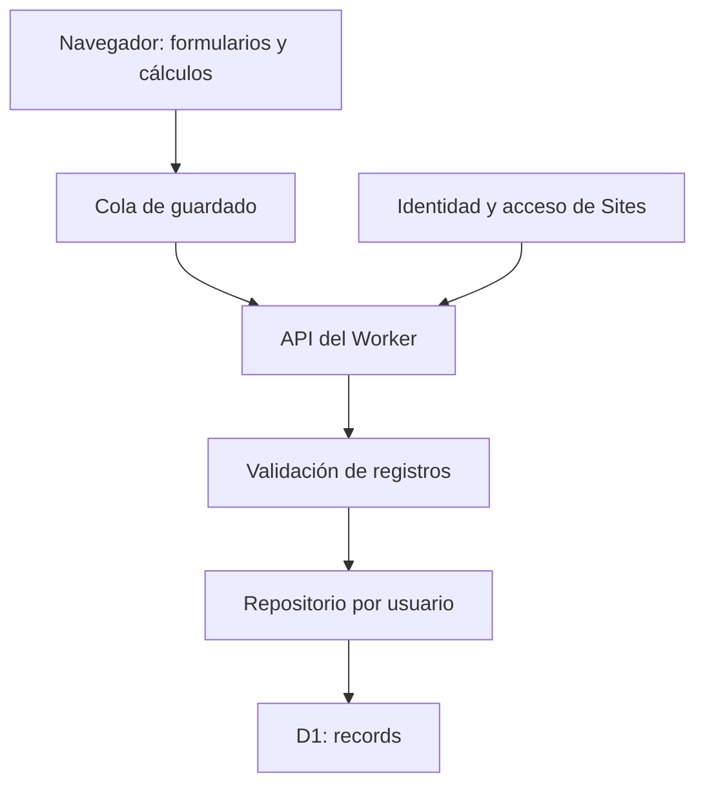

# Arquitectura

## Componentes

El navegador calcula los resultados para responder inmediatamente a las ediciones. El servidor almacena entradas, no resultados derivados. Así no hay dos totales persistidos que puedan divergir. Cada petición obtiene su repositorio con la identidad que proporciona Sites.

## Mapa de módulos

| Ruta                    | Responsabilidad                                               |
| ----------------------- | ------------------------------------------------------------- |
| `web/index.html`        | Estructura principal, navegación y estados de carga           |
| `web/app.js`            | Coordinación de selección, eventos, CRUD de filas y registros |
| `web/views.mjs`         | Renderizado de producción, NPK y configuración                |
| `web/ui.mjs`            | Formato regional, escape HTML y controles reutilizables       |
| `web/api.mjs`           | Transporte HTTP del mismo origen y errores                    |
| `web/save-queue.mjs`    | Serialización y seguimiento de borradores pendientes          |
| `web/calc.mjs`          | Funciones puras de cálculo                                    |
| `web/data.mjs`          | Datos iniciales de referencia                                 |
| `server/worker.mjs`     | Entrada `fetch`, servicio de assets y rutas de API            |
| `server/http.mjs`       | Errores HTTP esperados y lectura acotada de JSON              |
| `server/validate.mjs`   | Contrato de entradas antes de escribir                        |
| `server/seeds.mjs`      | Primera inicialización e importación heredada                 |
| `server/database.mjs`   | SQL parametrizado, alcance por propietario y revisiones       |
| `db/schema.ts`          | Fuente del esquema para Drizzle                               |
| `drizzle/`              | Historial de migraciones y snapshots                          |
| `scripts/build.mjs`     | Bundling y empaquetado de assets mediante módulo virtual      |
| `tooling/sqlite-d1.mjs` | Adaptador de la parte de D1 usada en desarrollo/pruebas       |

Los módulos de servidor no forman parte del mapa de archivos servidos al navegador. El bundle del Worker contiene los assets porque la aplicación es pequeña. El acceso a un asset usa un mapa explícito: una URL no se convierte en una ruta del sistema de archivos.

## De una edición al guardado

1. Un control con `data-path` identifica la propiedad de un registro seleccionado.
2. El controlador actualiza el borrador en memoria y vuelve a calcular los resultados.
3. La cola marca el ID como pendiente y espera 650 ms desde la última edición.
4. Se envía una copia del registro con su revisión conocida.
5. SQL actualiza solo si `owner`, `id` y `revision` coinciden.
6. El cliente incorpora la nueva revisión. Si hubo ediciones durante la petición, envía otro snapshot usando esa revisión.
7. La cola elimina el pendiente únicamente cuando se ha guardado su última generación.

Una cola vacía no deja un estado de petición activa. Un fallo de red conserva el borrador. Un `409` bloquea los nuevos intentos automáticos para impedir que una edición local sobrescriba un cambio externo. La resolución actual es recargar explícitamente, con confirmación de descarte del borrador.

## Estado y renderizado

`records` contiene los registros cargados; `selection` mantiene el ID seleccionado de cada calculadora; `state` enlaza con sus datos. Configuración es un registro fijo. Cambiar la selección exige completar los guardados pendientes. Cambiar de apartado mantiene los borradores en memoria.

Las vistas usan HTML generado con escape de valores del usuario. Los eventos se delegan en el documento para que sigan funcionando cuando se reconstruye una tabla. Los cálculos y el transporte permanecen fuera de las vistas.

No existe sincronización en tiempo real: un segundo dispositivo recibe datos al abrir o recargar. La revisión optimista evita sobrescrituras silenciosas entre dispositivos.
